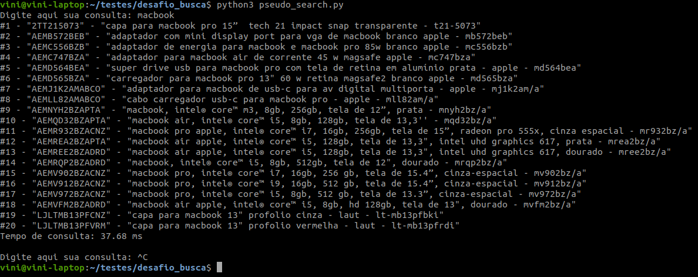

# Pseudo Seach System

Um pseudo sistema de buscas.

## Funcionamento
O sistema utiliza o arquivo *catalogo_produtos.json* como seu banco de dados. Ao inicializar, o software aguarda a entrada de uma palavra, que será utilizada na busca. Na primeira busca, o software lê diretamente do arquivo (suposto banco de dados) os primeiros 20 registros que possuem a palavra pesquisada. Ainda nesta primeira consulta, os dados são ordenados e salvos em memória em um dicionário (tabela hash), que utiliza como entrada a mesma palavra utilizada na pesquisa. Este procedimento é realizado para que as próximas pesquisas, que utilizam o mesmo termo, retornem de forma mais performática. Ou seja, a partir da segunda busca, a palavra pesquisada é apenas colocada como entrada da tabela hash, retornando os resultados da pesquisa em um tempo bem menor do que foi necessário na primeira consulta. Este resultado pode ser observado a partir do tempo de consulta, que é exibido no fim de cada busca realizada.

## Execução

Para executar o sistema, é necessário o Python na versão 3, que deve ser executado da seguinte forma:

    $ python3 pseudo_search.py

A seguir, basta inserir a palavra de busca. A figura a seguir exibe um exemplo de execução.

  

Para parar o sistema, execute CTRL + C.

